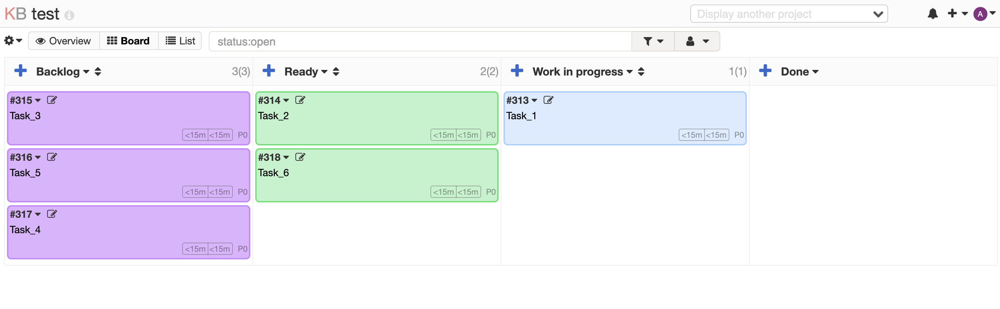

# <h2 align="center">Tests(UI, API) for the Kanboard App</h3>
****
<div align="center">
  <a href="https://github.com/Tetiana1386/Kanboard">
    
  </a>
</div>

## Getting Started
****

Run your app with Compose:

1. From project directory, start up your application by running:
  ```sh
  $ docker compose up
  ```
2. Enter http://localhost:80/ in a browser to see the application running.
3. If this doesn’t resolve, you can also try http://127.0.0.1:80.

## Commands for running tests:
****


-[x] `mvn clean test -Papi_regression` - to run all API tests;


-[x] `mvn clean test -Pui_regression -Dbrowser=chrome -Dheadless=false` - to run all Ui tests in the Chrome browser;


-[x] `mvn clean test -Pui_regression -Dbrowser=firefox -Dheadless=false` - to run all Ui tests in the Firefox browser;


-[x] `mvn clean test -Pui_regression -Dbrowser=chrome -Dheadless=true` - to run all Ui tests in the headless mode Chrome browser;


## Commands for receiving Allure report:
****


-[x] `allure generate target/allure-results`;


-[x] `allure serve target/allure-results`.

