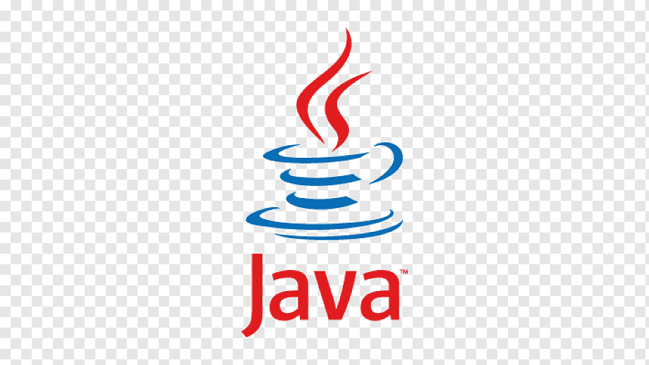

# <h2 align="center">Tests(UI, API) for the Kanboard App</h3>
---
<div align="center">
  <a href="https://github.com/Tetiana1386/Kanboard">
    
  </a>
</div>

## Frameworks & Tools
---

<code></code>
<code></code>
<code></code>
<code></code>
<code></code>
<code></code>
<code></code>
<code></code>
<code></code>
<code></code>

## Getting Started
---

Run your app with Compose:

1. From project directory, start up your application by running:
  ```sh
  $ docker compose up
  ```
2. Enter http://localhost:8080/ in a browser to see the application running.
3. If this doesn’t resolve, you can also try http://127.0.0.1:8080.

## Commands for running tests:
---


- [x] To run all API tests:
  ```sh
  $ mvn clean test -Papi_regression
  ```


- [x] To run all Ui tests in the Chrome browser:
  ```sh
  $ mvn clean test -Pui_regression -Dbrowser=chrome -Dheadless=false
  ```


- [x] To run all Ui tests in the Firefox browser:
  ```sh
  $ mvn clean test -Pui_regression -Dbrowser=firefox -Dheadless=false
  ```


- [x] To run all Ui tests in the headless mode Chrome browser:
  ```sh
  $ mvn clean test -Pui_regression -Dbrowser=chrome -Dheadless=true
  ```


- [x] To run all DB tests:
  ```sh
  $ mvn clean test -Pdb_regression
  ```


## Commands for receiving Allure report:
---


  ```sh
  $ allure generate target/allure-results
  ```


  ```sh
  $ allure serve target/allure-results
  ```

## My Allure reports:
---

- [x] [Allure report UI_Tests](https://github.com/Tetiana1386/Kanboard/blob/main/src/images/screenshots/AR_UI_TESTS.png)


- [x] [Allure report API_Tests](https://github.com/Tetiana1386/Kanboard/blob/main/src/images/screenshots/AR_API_TESTS.png)


- [x] [Allure report DB_Tests](https://github.com/Tetiana1386/Kanboard/blob/main/src/images/screenshots/AR_DB_TESTS.png)


- [x] [Jenkins_API_Tests](https://github.com/Tetiana1386/Kanboard/blob/main/src/images/screenshots/Jenkins_API_TESTS.png)
